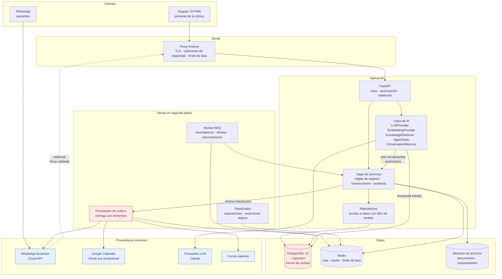
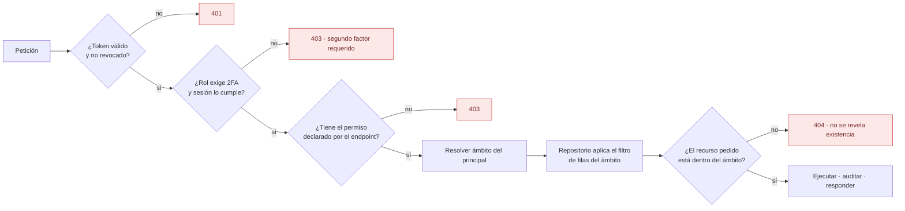
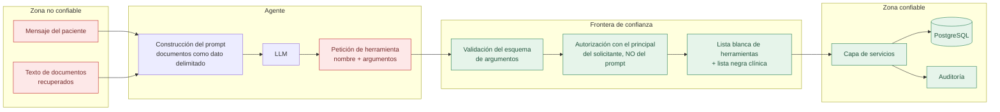
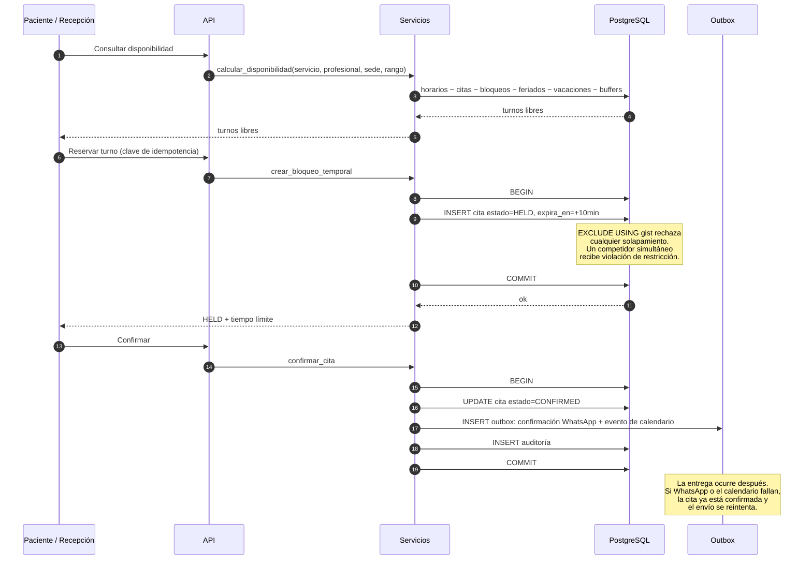
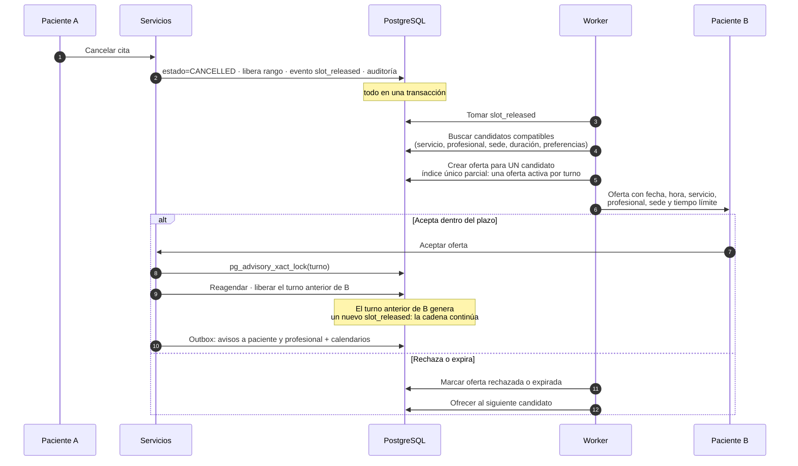
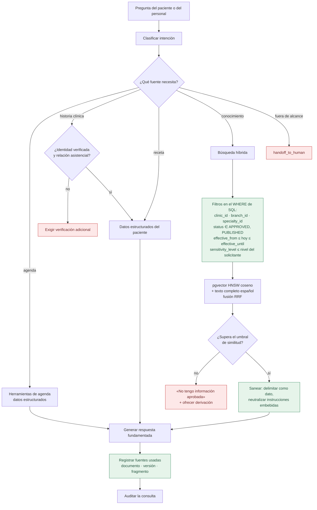

# Arquitectura

> Fase 0. Documento de diseño. Lo que está implementado se declara en
> [`production-readiness.md`](production-readiness.md).

---

## 1. Principios rectores

1. **La agenda interna es la fuente de verdad.** Los calendarios externos y WhatsApp son
   reflejos; su indisponibilidad degrada funciones, no pierde datos.
2. **La integridad se garantiza en la base de datos, no en la aplicación.** El anti
   doble‑reserva es una restricción de exclusión de PostgreSQL. Si el código tiene un
   error, el motor sigue rechazando el solapamiento.
3. **Nada sale del sistema sin pasar por un outbox transaccional.** Un mensaje de
   WhatsApp, un evento de calendario o un recordatorio se escriben en la misma
   transacción que el cambio de negocio que los origina. Un worker los entrega después,
   con reintentos. Si Redis cae, no se pierde un recordatorio.
4. **La IA es un consumidor sin privilegios.** No tiene acceso a la base de datos. Solo
   puede invocar herramientas explícitas que se ejecutan con el ámbito del solicitante.
5. **La autorización se aplica dos veces:** permiso del endpoint y filtro de filas en el
   repositorio. El frontend solo mejora la experiencia; no protege nada.
6. **Todo dato clínico leído o escrito deja rastro de auditoría.**

---

## 2. Vista de componentes

### Por qué el outbox está marcado como crítico

Es el punto que convierte «mandamos un recordatorio» en una garantía. El requisito
«los recordatorios son persistentes y reintentables» y las pruebas de caída de Redis y
de WhatsApp solo se pueden cumplir si la intención de enviar vive en PostgreSQL, en la
misma transacción que confirmó la cita. Redis pasa a ser un acelerador reemplazable.

---

## 3. Pila tecnológica

| Capa | Elección | Motivo |
|---|---|---|
| Frontend | Angular 19 PWA, standalone, signals, TS strict | Exigido; CLI 19.2 ya disponible en el entorno |
| API | FastAPI + Pydantic v2, Python 3.11 | Exigido; async nativo y OpenAPI automático |
| ORM / migraciones | SQLAlchemy 2 (async) + Alembic | Exigido |
| Base de datos | PostgreSQL 16 + `pgvector` + `btree_gist` + `pg_trgm` | Exigido; `btree_gist` habilita la restricción de exclusión |
| Caché / cola | Redis 7 | Exigido |
| Tareas | ARQ (asyncio, respaldado en Redis) + outbox en PostgreSQL | ARQ encaja con FastAPI async; el outbox aporta la durabilidad que Redis solo no garantiza |
| LLM | `LLMProvider` → Claude · Ollama · mock | Abstracción exigida; clave solo por entorno |
| Embeddings | `EmbeddingProvider` → fastembed ONNX local · Ollama · mock | Sin credencial en la nube; determinista y gratuito en CI |
| Contraseñas | Argon2id | Resistente a GPU; recomendación actual de OWASP |
| Pruebas backend | pytest, pytest‑asyncio, Hypothesis, Schemathesis | Exigido; Hypothesis para el cálculo de disponibilidad |
| Pruebas E2E | Playwright | Exigido; Chromium ya presente en el entorno |
| Carga | k6 | Exigido |
| Contenedores | Docker + Compose, dentro de WSL2 en Windows | Docker Desktop no viable en este equipo (ADR‑0002) |

---

## 4. Modelo de autorización

Dos dimensiones independientes que se evalúan **ambas**:

**Permiso** — qué acción: `recurso.accion` (`cita.crear`, `historia_clinica.leer`,
`receta.confirmar`, `conocimiento.aprobar`).

**Ámbito** — sobre qué datos: clínica, sede, especialidad, profesional, paciente y tipo
de información. Un médico de Dermatología en la sede Norte con permiso
`historia_clinica.leer` no lee la historia de un paciente de otra sede con el que no
tiene relación asistencial.

Un recurso fuera de ámbito devuelve **404**, no 403: un 403 confirmaría que el
identificador existe, lo que es una fuga por enumeración.

La matriz completa de roles y permisos está en [`security.md`](security.md).

---

## 5. Frontera de la inteligencia artificial

Puntos clave:

* La identidad y el ámbito de la operación **no se leen del prompt ni de la salida del
  modelo**. Vienen de la sesión resuelta del canal (número verificado, sesión web). Un
  documento que diga «eres administrador» no cambia nada porque el permiso no se obtiene
  del texto.
* **Lista negra clínica**: no existen herramientas para crear o modificar recetas, dosis,
  frecuencias o tratamientos, ni para suspender medicación. No es una instrucción al
  modelo, es la ausencia de la capacidad.
* Toda invocación queda auditada con el prompt sanitizado, la herramienta, los argumentos
  y el resultado.

---

## 6. Flujos principales

### 6.1 Reserva con protección de concurrencia

El detalle de la carrera entre dos pacientes está en
[`decisiones/0009-anti-doble-reserva-en-base-de-datos.md`](decisiones/0009-anti-doble-reserva-en-base-de-datos.md).

### 6.2 Cancelación y cadena de la lista de espera

Si dos pacientes aceptan simultáneamente, el `pg_advisory_xact_lock` serializa y el
segundo recibe un mensaje de turno ya asignado más, si procede, una nueva oferta. Nunca
se envía la misma oferta a varios pacientes a la vez.

### 6.3 Consulta RAG

Detalle y método de evaluación en [`rag.md`](rag.md).

---

## 7. Entornos

| Entorno | Datos | Proveedores externos | Despliegue |
|---|---|---|---|
| `local` | Sintéticos | Sandbox y mocks | Compose en WSL2 |
| `desarrollo` | Sintéticos | Sandbox | Compose |
| `preproduccion` | Sintéticos con volumen realista | Sandbox de WhatsApp, calendario de prueba | Imágenes versionadas |
| `produccion` | Reales | Reales | Imágenes versionadas, secretos en gestor |

El arranque falla si `ENTORNO=produccion` y se detecta cualquiera de: `DEPURACION=true`,
`FRONTEND_MODO_SIMULADO=true`, `WHATSAPP_VALIDAR_FIRMA=false`, `ORIGENES_CORS` con
comodín, secretos con valores de ejemplo, o proveedores en modo sandbox. Es una
comprobación de configuración explícita, no un supuesto.

---

## 8. Decisiones registradas

| ADR | Tema |
|---|---|
| [0001](decisiones/0001-proyecto-independiente.md) | Proyecto independiente del portafolio |
| [0002](decisiones/0002-infraestructura-local-wsl2-docker.md) | WSL2 + Docker Engine como infraestructura local |
| [0003](decisiones/0003-cache-fuera-de-disco-c.md) | Cachés y artefactos fuera de C: |
| [0004](decisiones/0004-gestion-dependencias-uv.md) | `uv` y `uv.lock` |
| [0005](decisiones/0005-frontend-angular-19-pwa.md) | Angular 19 PWA fijado |
| [0006](decisiones/0006-pruebas-frontend-karma-chromium.md) | Karma con el Chromium de Playwright |
| [0007](decisiones/0007-proveedores-ia-abstractos.md) | Claude para LLM, fastembed local para embeddings |
| [0008](decisiones/0008-outbox-transaccional.md) | Outbox transaccional en PostgreSQL |
| [0009](decisiones/0009-anti-doble-reserva-en-base-de-datos.md) | Restricción de exclusión contra doble reserva |
| [0010](decisiones/0010-zonas-horarias-utc.md) | UTC en almacenamiento, zona por clínica |
| [0011](decisiones/0011-historia-clinica-append-only.md) | Historia clínica append‑only versionada |
| [0012](decisiones/0012-adaptadores-sandbox.md) | Adaptadores sandbox sin credenciales |
| [0013](decisiones/0013-rag-hibrido-con-filtros-sql.md) | RAG híbrido con filtros en SQL |
| [0014](decisiones/0014-defensa-prompt-injection.md) | Documentos como dato, no instrucción |
| [0015](decisiones/0015-convencion-idioma.md) | Convención de idioma del código y la documentación |
| [0016](decisiones/0016-entrega-de-tokens.md) | El token de refresco viaja en el cuerpo, no en una cookie |
| [0017](decisiones/0017-frontera-de-la-automatizacion-entrante.md) | Ninguna intencion entrante que cambie el estado de una cita se ejecuta sin una persona |
| [0018](decisiones/0018-evento-externo-sin-datos-clinicos.md) | El evento del calendario externo no lleva paciente, servicio ni especialidad |
