# Modelo de datos

> Fase 0. Diseño. Las migraciones se crean en la Fase 2 y siguientes; este documento es el
> contrato que deben cumplir.

## Convenciones

* Claves primarias `UUID` con `gen_random_uuid()` (extensión `pgcrypto`). Se evita el
  entero autoincremental porque los identificadores aparecen en URLs y en mensajes de
  WhatsApp, y un secuencial permite enumerar pacientes.
* Todo instante en `TIMESTAMPTZ` (UTC). Ver [ADR‑0010](decisiones/0010-zonas-horarias-utc.md).
* Identificadores en español sin diacríticos, salvo las excepciones de
  [ADR‑0015](decisiones/0015-convencion-idioma.md).
* Columnas de auditoría en toda tabla mutable: `creado_en`, `creado_por`,
  `actualizado_en`, `actualizado_por`.
* Borrado lógico (`anulado_en`, `anulado_por`, `motivo_anulacion`) en lugar de `DELETE`
  para toda entidad con valor histórico. Las tablas de versión clínica no admiten ni
  `UPDATE` ni `DELETE`.
* Extensiones requeridas: `pgcrypto`, `btree_gist`, `pg_trgm`, `vector`, `unaccent`.

---

## 1. Vista general

```mermaid
erDiagram
    CLINICA ||--o{ SEDE : tiene
    CLINICA ||--o{ ESPECIALIDAD : ofrece
    CLINICA ||--o{ USUARIO : emplea
    CLINICA ||--o{ CONFIGURACION_CLINICA : configura
    CLINICA ||--o{ PLANTILLA_ANAMNESIS : define
    SEDE ||--o{ CONSULTORIO : contiene
    SEDE ||--o{ HORARIO_ATENCION : define
    SEDE ||--o{ FERIADO : observa

    USUARIO ||--o{ USUARIO_ROL : posee
    ROL ||--o{ USUARIO_ROL : asignado
    ROL ||--o{ ROL_PERMISO : agrupa
    PERMISO ||--o{ ROL_PERMISO : incluido
    USUARIO_ROL ||--o{ AMBITO_ASIGNACION : limita

    USUARIO ||--o| PROFESIONAL : es
    PROFESIONAL }o--|| ESPECIALIDAD : ejerce
    PROFESIONAL ||--o{ PROFESIONAL_SEDE : atiende_en
    PROFESIONAL ||--o{ PROFESIONAL_SERVICIO : presta
    PROFESIONAL ||--o{ AGENDA_PLANTILLA : trabaja
    PROFESIONAL ||--o{ RESPUESTA_ANAMNESIS : captura
    PROFESIONAL ||--o{ BLOQUEO_AGENDA : bloquea
    PROFESIONAL ||--o| CALENDARIO_CONEXION : conecta

    ESPECIALIDAD ||--o{ SERVICIO : agrupa
    SERVICIO ||--o{ PROFESIONAL_SERVICIO : ofrecido

    PACIENTE ||--o{ PACIENTE_CONTACTO : registra
    PACIENTE ||--o{ CONSENTIMIENTO : otorga
    PACIENTE ||--o{ CITA : agenda
    PACIENTE ||--o{ HISTORIA_CLINICA : posee
    PACIENTE ||--o{ RESPUESTA_ANAMNESIS : registra
    PACIENTE ||--o{ RECETA : recibe
    PACIENTE ||--o{ LISTA_ESPERA : espera
    PACIENTE ||--o{ CONVERSACION : conversa
    PACIENTE ||--o{ DOCUMENTO_PACIENTE : aporta

    CITA }o--|| SERVICIO : de
    CITA }o--|| PROFESIONAL : con
    CITA }o--|| SEDE : en
    CITA }o--o| CONSULTORIO : usa
    CITA ||--o{ CITA_HISTORIAL : registra
    CITA ||--o| PAGO : genera
    CITA ||--o{ CALENDARIO_EVENTO : refleja
    CITA ||--o{ RECORDATORIO : programa

    HISTORIA_CLINICA ||--o{ NOTA_EVOLUCION : contiene
    PLANTILLA_ANAMNESIS ||--o{ RESPUESTA_ANAMNESIS : versiona
    NOTA_EVOLUCION ||--o{ NOTA_EVOLUCION_VERSION : versiona
    NOTA_EVOLUCION }o--o| CITA : documenta

    RECETA ||--o{ RECETA_VERSION : versiona
    RECETA ||--o{ RECETA_ITEM : detalla
    RECETA_ITEM ||--o{ TOMA_PROGRAMADA : genera
    TOMA_PROGRAMADA ||--o| TOMA_REGISTRO : responde
    TOMA_REGISTRO ||--o{ ALERTA_ADHERENCIA : dispara

    LISTA_ESPERA ||--o{ OFERTA_TURNO : recibe
    OFERTA_TURNO }o--|| SLOT_LIBERADO : sobre

    CONVERSACION ||--o{ MENSAJE : agrupa
    MENSAJE ||--o{ INVOCACION_HERRAMIENTA : origina

    KNOWLEDGE_DOCUMENTS ||--o{ KNOWLEDGE_VERSIONS : versiona
    KNOWLEDGE_DOCUMENTS ||--o{ KNOWLEDGE_CHUNKS : fragmenta
    KNOWLEDGE_CHUNKS ||--o| KNOWLEDGE_EMBEDDINGS : vectoriza
    KNOWLEDGE_DOCUMENTS ||--o{ KNOWLEDGE_PERMISSIONS : restringe
    KNOWLEDGE_DOCUMENTS ||--o{ KNOWLEDGE_INGESTION_JOBS : procesa
```



---

## 2. Organización de la clínica

**`clinica`** — `id`, `nombre`, `identificacion_fiscal`, `zona_horaria`
(por defecto `America/Guayaquil`), `idioma`, `activa`.

**`sede`** — `id`, `clinica_id`, `nombre`, `direccion`, `telefono`, `zona_horaria`
(hereda de la clínica si es nula), `activa`. El modelo admite varias sedes desde el
inicio aunque la operación arranque con una.

**`consultorio`** — `id`, `sede_id`, `nombre`, `tipo`, `capacidad`, `activo`.
Es el recurso físico que la restricción de exclusión protege junto al profesional.

**`especialidad`** — `id`, `clinica_id`, `nombre`, `codigo`, `activa`.

**`servicio`** — `id`, `clinica_id`, `especialidad_id`, `nombre`, `duracion_minutos`,
`minutos_preparacion`, `precio`, `moneda`, `requiere_pago_previo`,
`instrucciones_preparacion`, `activo`.

**`horario_atencion`** — `id`, `propietario_tipo` (`SEDE` | `PROFESIONAL`),
`propietario_id`, `dia_semana`, `hora_inicio`, `hora_fin`, `vigente_desde`,
`vigente_hasta`. Horas **locales**: «atiende de 08:00 a 13:00» es una afirmación local.

**`descanso`** — `id`, `horario_atencion_id`, `hora_inicio`, `hora_fin`, `motivo`.

**`feriado`** — `id`, `clinica_id`, `sede_id` (nulo = toda la clínica), `fecha`,
`nombre`, `recurrente_anual`.

**`configuracion_clinica`** — `clinica_id`, `clave`, `valor` (`jsonb`), `actualizado_por`.
Guarda política de cancelación, horas de recordatorio, configuración de pagos,
plantillas aprobadas y ventanas de oferta. Se versiona por auditoría.

---

## 3. Usuarios, roles y ámbito

**`usuario`** — `id`, `clinica_id`, `correo` (único por clínica), `hash_contrasena`
(Argon2id), `nombre`, `apellido`, `telefono`, `activo`, `correo_verificado_en`,
`ultimo_acceso_en`, `intentos_fallidos`, `bloqueado_hasta`, `secreto_2fa_cifrado`,
`2fa_habilitado`, `debe_cambiar_contrasena`.

**`rol`** — `id`, `clinica_id` (nulo = rol del sistema), `codigo`, `nombre`,
`es_sistema`. Roles base: `superadministrador`, `administrador_clinica`, `recepcion`,
`profesional`, `asistente`, `auditor`.

**`permiso`** — `id`, `codigo` (`recurso.accion`), `descripcion`, `categoria`,
`requiere_relacion_asistencial` (booleano). El último campo marca los permisos que,
además del rol, exigen vínculo con el paciente.

**`rol_permiso`** — `rol_id`, `permiso_id`.

**`usuario_rol`** — `id`, `usuario_id`, `rol_id`, `otorgado_por`, `otorgado_en`,
`vigente_hasta`.

**`ambito_asignacion`** — `id`, `usuario_rol_id`, `tipo`
(`CLINICA` | `SEDE` | `ESPECIALIDAD` | `PROFESIONAL` | `PACIENTE` | `TIPO_INFORMACION`),
`valor_id`, `incluir` (booleano: permite listas de exclusión). Un `usuario_rol` sin
ámbitos se interpreta como alcance nulo, no como alcance total: el valor por defecto es
el más restrictivo.

**`sesion`** — `id`, `usuario_id`, `jti_refresco_hash`, `ip`, `agente_usuario`,
`creada_en`, `expira_en`, `revocada_en`, `motivo_revocacion`. La rotación del token de
refresco inserta una fila nueva y revoca la anterior; reutilizar un refresco ya rotado
revoca toda la familia de sesiones (detección de robo de token).

**`historial_acceso`** — `id`, `usuario_id`, `correo_intentado`, `resultado`
(`EXITO` | `CREDENCIAL_INVALIDA` | `BLOQUEADO` | `2FA_FALLIDO`), `ip`, `agente_usuario`,
`ocurrido_en`.

**`auditoria`** — `id`, `actor_tipo` (`USUARIO` | `SISTEMA` | `AGENTE_IA`), `actor_id`,
`accion`, `entidad_tipo`, `entidad_id`, `clinica_id`, `sede_id`, `paciente_id`,
`resultado`, `ip`, `origen` (`WEB` | `API` | `WHATSAPP` | `WORKER`), `metadatos` (`jsonb`
sin datos clínicos en claro), `ocurrido_en`. Append‑only: el rol de la aplicación no
tiene privilegio de `UPDATE` ni `DELETE` sobre esta tabla.

---

## 4. Profesionales

**`profesional`** — `id`, `usuario_id`, `clinica_id`, `especialidad_id`,
`numero_registro_profesional`, `telefono_whatsapp`, `correo_calendario`,
`estado_disponibilidad`, `acepta_pacientes_nuevos`, `minutos_preparacion_propio`,
`config_recordatorios` (`jsonb`), `activo`.

> Nunca se almacena la contraseña del calendario del profesional. La conexión es OAuth y
> solo se guardan tokens cifrados. Ver [ADR‑0012](decisiones/0012-adaptadores-sandbox.md).

**`profesional_sede`** — `profesional_id`, `sede_id`, `principal`.

**`profesional_servicio`** — `profesional_id`, `servicio_id`,
`duracion_minutos_override`, `precio_override`.

**`agenda_plantilla`** — `id`, `profesional_id`, `sede_id`, `dia_semana`, `hora_inicio`,
`hora_fin`, `granularidad_minutos`, `vigente_desde`, `vigente_hasta`.

**`bloqueo_agenda`** — `id`, `profesional_id` (nulo = toda la sede), `sede_id`,
`tipo` (`VACACIONES` | `AUSENCIA` | `CAPACITACION` | `MANTENIMIENTO` | `OTRO`),
`inicio`, `fin`, `motivo`, `creado_por`. Los bloqueos restan disponibilidad y se
consideran en el cálculo igual que las citas.

**`calendario_conexion`** — `id`, `profesional_id`, `proveedor`, `calendar_id`,
`token_acceso_cifrado`, `token_refresco_cifrado`, `expira_en`, `alcances`,
`estado_sincronizacion` (`CONECTADO` | `TOKEN_VENCIDO` | `DESCONECTADO` | `ERROR`),
`ultima_sincronizacion_en`, `ultimo_error`, `token_sincronizacion_incremental`.

**`calendario_evento`** — `id`, `cita_id`, `profesional_id`, `calendario_conexion_id`,
`calendar_id`, `external_event_id`, `etag`, `estado`, `sincronizado_en`, `ultimo_error`.
Único por `(calendario_conexion_id, external_event_id)`. Es la tabla que mantiene la
relación exigida entre `appointment_id`, `professional_id`, `calendar_id` y
`external_event_id`.

---

## 5. Pacientes

**`paciente`** — `id`, `clinica_id`, `tipo_documento`, `numero_documento`, `nombre`,
`apellido`, `fecha_nacimiento`, `sexo`, `telefono_whatsapp`, `whatsapp_verificado_en`,
`correo`, `direccion`, `preferencias_horario` (`jsonb`), `nivel_verificacion`
(`NO_VERIFICADO` | `TELEFONO` | `DOCUMENTO` | `PRESENCIAL`), `activo`.

Índice único `(clinica_id, tipo_documento, numero_documento)`.
`telefono_whatsapp` tiene índice **no único**: un teléfono familiar puede corresponder a
varias personas. **El número de WhatsApp nunca es identificación suficiente para acceder
a datos clínicos sensibles**: se requiere `nivel_verificacion >= DOCUMENTO`, que se
comprueba en la capa de servicios.

**`paciente_contacto`** — `id`, `paciente_id`, `nombre`, `relacion`, `telefono`,
`es_emergencia`, `autorizado_a_recibir_informacion`.

**`consentimiento`** — `id`, `paciente_id`, `tipo` (`TRATAMIENTO_DATOS` |
`COMUNICACION_WHATSAPP` | `RECORDATORIOS_MEDICACION` | `COMPARTIR_CON_TERCEROS`),
`otorgado`, `version_texto`, `texto_hash`, `otorgado_en`, `revocado_en`, `canal`,
`evidencia` (`jsonb`). El opt‑out de WhatsApp revoca el consentimiento correspondiente y
detiene los envíos proactivos de inmediato.

**`documento_paciente`** — `id`, `paciente_id`, `tipo`, `nombre_archivo`,
`ruta_almacenamiento`, `tipo_mime`, `tamano_bytes`, `hash_sha256`, `subido_por`,
`escaneo_antivirus` (`PENDIENTE` | `LIMPIO` | `INFECTADO` | `NO_DISPONIBLE`).

**`alergia`** — `id`, `paciente_id`, `sustancia`, `tipo_reaccion`, `severidad`,
`registrado_por`, `registrado_en`, `activa`. Solo un profesional la registra.

**`antecedente`** — `id`, `paciente_id`, `categoria`, `descripcion`, `registrado_por`.

---

## 6. Agenda

**`cita`** — el núcleo del sistema.

| Columna | Notas |
|---|---|
| `id` | UUID |
| `clinica_id`, `sede_id`, `consultorio_id` | ubicación |
| `paciente_id`, `profesional_id`, `servicio_id` | participantes |
| `inicio` | `TIMESTAMPTZ` |
| `duracion_minutos`, `minutos_preparacion` | del servicio o del profesional |
| `duracion_total` | columna generada: duración + preparación |
| `rango` | **generada**: `tstzrange(inicio, inicio + duracion_total, '[)')` |
| `estado` | `PENDING` `HELD` `CONFIRMED` `RESCHEDULED` `CANCELLED` `COMPLETED` `NO_SHOW` |
| `expira_en` | solo en `HELD`; el barrido libera al vencer |
| `origen` | `PANEL` `WHATSAPP` `LISTA_ESPERA` `RECURRENTE` |
| `clave_idempotencia` | única cuando no es nula |
| `cita_origen_id` | reprogramaciones: apunta a la cita anterior |
| `serie_recurrente_id` | citas recurrentes |
| `motivo_cancelacion`, `cancelada_por`, `cancelada_en` | |
| `confirmada_en`, `completada_en` | |
| `notas_recepcion` | texto administrativo, **no** clínico |

Restricciones críticas (ver [ADR‑0009](decisiones/0009-anti-doble-reserva-en-base-de-datos.md)):

```sql
EXCLUDE USING gist (profesional_id WITH =, rango WITH &&)
  WHERE (estado IN ('HELD','CONFIRMED','RESCHEDULED'))
EXCLUDE USING gist (consultorio_id WITH =, rango WITH &&)
  WHERE (estado IN ('HELD','CONFIRMED','RESCHEDULED') AND consultorio_id IS NOT NULL)
CHECK (duracion_minutos > 0)
CHECK (estado <> 'HELD' OR expira_en IS NOT NULL)
CHECK (estado <> 'CANCELLED' OR motivo_cancelacion IS NOT NULL)
```

**`cita_historial`** — `id`, `cita_id`, `estado_anterior`, `estado_nuevo`,
`inicio_anterior`, `inicio_nuevo`, `actor_tipo`, `actor_id`, `motivo`, `ocurrido_en`.
Append‑only.

**`clave_idempotencia`** — `clave`, `alcance`, `hash_peticion`, `respuesta` (`jsonb`),
`estado`, `creado_en`, `expira_en`. Sirve a la API y a los webhooks. Una repetición con
la misma clave y el mismo cuerpo devuelve la respuesta guardada; con cuerpo distinto
devuelve conflicto.

---

## 7. Lista de espera

**`lista_espera`** — `id`, `paciente_id`, `clinica_id`, `servicio_id`,
`especialidad_id`, `profesional_id` (nulo = cualquiera), `sede_id`,
`ventanas_preferidas` (`jsonb`: días y rangos horarios), `fecha_deseada_desde`,
`fecha_deseada_hasta`, `prioridad`, `estado` (`ACTIVA` | `OFERTA_ENVIADA` | `CUMPLIDA` |
`CANCELADA` | `EXPIRADA`), `cita_actual_id` (si espera un hueco mejor),
`veces_ofrecido`, `creado_en`.

**`slot_liberado`** — `id`, `cita_origen_id`, `profesional_id`, `sede_id`,
`consultorio_id`, `servicio_id`, `inicio`, `duracion_total`, `estado`
(`DISPONIBLE` | `EN_OFERTA` | `ASIGNADO` | `EXPIRADO`), `liberado_en`,
`asignado_a_cita_id`. Se crea en la misma transacción que la cancelación.

**`oferta_turno`** — `id`, `slot_liberado_id`, `lista_espera_id`, `paciente_id`,
`enviada_en`, `expira_en`, `estado` (`ENVIADA` | `ACEPTADA` | `RECHAZADA` | `EXPIRADA` |
`PERDIDA_POR_CARRERA`), `respondida_en`, `mensaje_id`, `cita_resultante_id`.

Índice único parcial, que es el que garantiza «una oferta a la vez»:

```sql
CREATE UNIQUE INDEX oferta_una_activa_por_slot
  ON oferta_turno (slot_liberado_id)
  WHERE estado = 'ENVIADA';
```

---

## 8. Historia clínica

**`historia_clinica`** — `id`, `paciente_id`, `clinica_id`, `abierta_en`, `estado`.
Una por paciente y clínica.

**`nota_evolucion`** — `id`, `historia_clinica_id`, `paciente_id`, `cita_id`,
`profesional_id_creador`, `version_vigente_id`, `estado` (`BORRADOR` | `FIRMADA` |
`ANULADA`), `creado_en`.

**`nota_evolucion_version`** — **inmutable**. `id`, `nota_evolucion_id`,
`numero_version`, `motivo_consulta`, `contenido` (`jsonb` estructurado: subjetivo,
objetivo, evaluación, plan), `diagnosticos` (`jsonb`, solo profesional),
`indicaciones`, `autor_id`, `creado_en`, `motivo_modificacion`, `version_anterior_id`.

```sql
CHECK (numero_version = 1 OR motivo_modificacion IS NOT NULL)
UNIQUE (nota_evolucion_id, numero_version)
```

Ver [ADR‑0011](decisiones/0011-historia-clinica-append-only.md).

**`plantilla_anamnesis`** — una definición versionada por clínica con preguntas JSONB
validadas, estado (`BORRADOR` | `PUBLICADA` | `RETIRADA`), sensibilidad (`N2` | `N3`) y
fecha de publicación. Solo puede existir una versión publicada por nombre y clínica; al
publicar se congela el contenido en PostgreSQL. Las ediciones parten de una nueva versión.

**`respuesta_anamnesis`** — captura inmutable enlazada a clínica, paciente, profesional,
plantilla y `version_plantilla`; almacena respuestas JSONB y el instante de registro. Un
trigger valida que la versión estuviera publicada y que la clínica coincida. No se permite
actualizar o borrar una respuesta. El acceso exige relación asistencial; N3 agrega el permiso
`historia_clinica.leer_sensible` y auditoría sensible. Migraciones 018 y 019.

**`examen`** — `id`, `paciente_id`, `nota_evolucion_id`, `tipo`, `solicitado_por`,
`solicitado_en`, `resultado_documento_id`, `estado`.

**`seguimiento`** — `id`, `paciente_id`, `origen_tipo`, `origen_id`,
`fecha_programada`, `responsable_id`, `estado`, `resultado`.

### Odontología: odontograma y planes

**`odontograma`** — `id`, `clinica_id`, `paciente_id`, `profesional_id`, `version`,
`vigente`, `nivel_sensibilidad` (`N2` | `N3`), `denticion` (`PERMANENTE` | `TEMPORAL` | `MIXTA`), `piezas` (`jsonb` con
hallazgos FDI validados), `motivo_modificacion`, `procedimiento_id`. Cada fila contiene
el estado completo de la boca. La versión vigente es única por paciente; las versiones
anteriores se conservan y no se editan ni eliminan. Desde la segunda versión se exige un
motivo. Completar un procedimiento con resultado clínico crea una versión ligada al
procedimiento dentro de la misma transacción.

**`plan_tratamiento`** — `id`, `clinica_id`, `paciente_id`, `profesional_id`, `titulo`,
`estado` (`BORRADOR` | `PROPUESTO` | `ACEPTADO` | `COMPLETADO` | `CANCELADO`), `moneda`,
`observaciones`, `propuesto_en`, `aceptado_en`, `aceptacion_medio`,
`nivel_sensibilidad` (`N2` | `N3`), `aceptacion_referencia`, `aceptacion_imagen_id`, `aceptacion_registrada_por`,
`completado_en`, `cancelado_en`, `motivo_cancelacion`. `ACEPTADO` y `COMPLETADO`
requieren fecha y constancia referenciada del documento firmado en la clínica. Esta
constancia no equivale a firma electrónica. Crear y leer un plan N3 requiere
`historia_clinica.leer_sensible`; los procedimientos heredan el nivel del plan.

**`procedimiento_plan`** — `id`, `plan_id`, `fase`, `orden`, `pieza`, `caras`, `servicio_id`,
`descripcion`, `precio`, `estado` (`PENDIENTE` | `COMPLETADO` | `CANCELADO`),
`hallazgo_resultante`, `cita_id`, `completado_en`, `completado_por`,
`control_recomendado_en`, `control_atendido_en`, `control_atendido_por`, `control_nota`,
`cancelado_en`, `motivo_cancelacion`. El control es opcional y solo se puede programar al
completar el procedimiento; la fecha la define el profesional. La atención queda asociada
al actor y al instante, y la nota solo se conserva cuando el control fue atendido. `cita_id`
apunta a la reserva vigente de esa fase; al cancelar una cita mientras el procedimiento
sigue pendiente, el vínculo se libera dentro de la misma transacción para permitir reagendar.

**`plantilla_plan`** — `id`, `clinica_id`, `nombre`, `descripcion`, `procedimientos`
(`jsonb` no vacío), más columnas de auditoría y anulación lógica. El nombre vigente es único
por clínica. Aplicar una plantilla genera un borrador editable; no acepta ni propone un plan
automáticamente.

**`registro_placa`** — `id`, `clinica_id`, `paciente_id`, `profesional_id`, `piezas_evaluadas`,
`superficies_con_placa` (`jsonb`), `total_superficies`, `total_con_placa`, `porcentaje`,
`observacion`. Registra el índice de O'Leary por superficies FDI y permite conservar la
serie histórica; los conteos y el porcentaje tienen restricciones de rango en PostgreSQL.

---

## 9. Recetas y adherencia

**`receta`** — `id`, `paciente_id`, `profesional_id`, `cita_id`,
`version_vigente_id`, `estado` (`BORRADOR` | `CONFIRMADA` | `MODIFICADA` | `SUSPENDIDA` |
`FINALIZADA`), `confirmada_en`, `confirmada_por`.

> **Solo el estado `CONFIRMADA` genera calendario de tomas.** La IA no puede crear,
> modificar ni confirmar recetas: no existe la herramienta.

**`receta_version`** — inmutable. `id`, `receta_id`, `numero_version`, `autor_id`,
`creado_en`, `motivo_modificacion`, `version_anterior_id`.

**`receta_item`** — `id`, `receta_version_id`, `medicamento_nombre`,
`medicamento_codigo`, `dosis`, `unidad`, `via`, `frecuencia_tipo`
(`CADA_N_HORAS` | `VECES_AL_DIA` | `HORARIOS_FIJOS` | `SEMANAL` | `PRN`),
`frecuencia_valor`, `horarios` (`jsonb`: horas locales), `fecha_inicio`, `fecha_fin`,
`instrucciones`, `es_prn`.

```sql
-- Un PRN no puede llevar horarios fijos: es la regla de seguridad clave
CHECK (NOT es_prn OR horarios IS NULL)
CHECK (frecuencia_tipo <> 'PRN' OR es_prn)
```

**`toma_programada`** — `id`, `receta_item_id`, `paciente_id`,
`programada_para` (`TIMESTAMPTZ`), `estado` (`PENDIENTE` | `RECORDADA` | `CONFIRMADA` |
`OMITIDA` | `REPROGRAMADA` | `CANCELADA`), `recordatorio_enviado_en`, `cancelada_por_version_id`.
Solo se generan para items **no PRN** de recetas confirmadas.

**`toma_registro`** — `id`, `toma_programada_id`, `respuesta`
(`TOME_EL_MEDICAMENTO` | `RECORDARME_DESPUES` | `NO_PUDE_TOMARLO` | `TENGO_UN_PROBLEMA` |
`HABLAR_CON_LA_CLINICA`), `registrado_en`, `canal`, `comentario_paciente`.

**`alerta_adherencia`** — `id`, `paciente_id`, `receta_item_id`, `tipo`
(`TOMA_OMITIDA` | `PATRON_BAJA_ADHERENCIA` | `PROBLEMA_REPORTADO` | `SIN_RESPUESTA`),
`severidad`, `estado`, `asignada_a`, `creado_en`, `atendida_en`, `resolucion`.

---

## 10. Conversaciones de WhatsApp

**`conversacion`** — `id`, `clinica_id`, `paciente_id` (nulo si no identificado),
`telefono_hash`, `canal`, `estado` (`ACTIVA` | `EN_ESPERA_HUMANO` | `CERRADA`),
`asignada_a_usuario_id`, `ventana_24h_expira_en`, `opt_in`, `opt_out_en`,
`ultimo_mensaje_en`.

**`mensaje`** — `id`, `conversacion_id`, `direccion` (`ENTRANTE` | `SALIENTE`),
`wa_message_id` (único), `tipo`, `contenido`, `plantilla_nombre`, `estado_entrega`
(`ENVIADO` | `ENTREGADO` | `LEIDO` | `FALLIDO`), `enviado_en`, `entregado_en`,
`leido_en`, `error`, `outbox_mensaje_id`.

`wa_message_id` único es lo que hace idempotente la recepción de webhooks duplicados.

**`webhook_recibido`** — `id`, `proveedor`, `firma_valida`, `payload_hash` (único),
`recibido_en`, `procesado_en`, `resultado`. Deduplica y deja traza de entregas repetidas
o fuera de orden.

**`invocacion_herramienta`** — `id`, `conversacion_id`, `mensaje_id`, `herramienta`,
`argumentos` (`jsonb`), `principal_id`, `autorizada`, `resultado`, `error`,
`duracion_ms`, `ocurrido_en`. Auditoría completa de lo que hizo el agente.

---

## 11. Base de conocimiento

Nombres en inglés por ser normativos ([ADR‑0015](decisiones/0015-convencion-idioma.md)).

**`knowledge_documents`** — `document_id`, `clinic_id`, `titulo`, `tipo`,
`status` (`DRAFT` | `PENDING_REVIEW` | `APPROVED` | `PUBLISHED` | `ARCHIVED`),
`version_vigente`, `responsable_id`, `aprobado_por`, `aprobado_en`,
`effective_from`, `effective_until`, `sensitivity_level`, `etiquetas` (`text[]`),
`branch_id`, `specialty_id`, `service_id`, `archivado_en`.

**`knowledge_versions`** — `id`, `document_id`, `version`, `nombre_archivo`,
`hash_sha256`, `ruta_almacenamiento`, `contenido_texto` (temporal: presente mientras el
trabajo de ingesta está pendiente o fallido; se elimina al completar), `autor_id`,
`creado_en`, `notas_cambio`,
`resultado_analisis_inyeccion` (`jsonb`).

**`knowledge_chunks`** — `id`, `document_id`, `version`, `indice_fragmento`,
`contenido`, `contenido_tsv` (`tsvector` generado con configuración `spanish`),
`tokens`, y los metadatos desnormalizados que permiten el pre‑filtro en SQL:
`clinic_id`, `branch_id`, `specialty_id`, `service_id`, `professional_id`, `status`,
`effective_from`, `effective_until`, `sensitivity_level`, `vigente`. El pre‑filtro
excluye versiones históricas incluso cuando el documento vuelve a aprobarse.

> La desnormalización es deliberada: permite que todo el filtro de autorización viva en
> un único `WHERE` sobre una tabla, sin uniones que se puedan omitir por error.

**`knowledge_embeddings`** — `chunk_id`, `modelo`, `dimension`,
`embedding vector(384)`, `creado_en`.

```sql
CREATE INDEX ON knowledge_embeddings
  USING hnsw (embedding vector_cosine_ops);
CREATE INDEX ON knowledge_chunks USING gin (contenido_tsv);
CREATE INDEX ON knowledge_chunks (clinic_id, status, effective_from, effective_until);
CREATE INDEX ON knowledge_chunks (document_id, vigente, status);
```

**`knowledge_permissions`** — `id`, `document_id`, `principal_tipo`
(`ROL` | `USUARIO` | `ESPECIALIDAD` | `SEDE`), `principal_id`, `puede_leer`,
`puede_usar_en_agente`.

Sin filas ACL, el documento conserva el acceso determinado por sus metadatos y
el ámbito del principal. Con filas ACL, la recuperación exige un grant
coincidente; una denegación directa prevalece sobre los grants heredados. El
personal requiere `puede_leer` y el agente además `puede_usar_en_agente`. Los
roles se comparan por su ID vigente, no por código.

**`knowledge_ingestion_jobs`** — `id`, `document_id`, `version`, `estado`, `paso_actual`,
`fragmentos_generados`, `embeddings_generados`, `error`, `intentos`, `creado_en`,
`finalizado_en`.

---

## 12. Pagos

**`cargo_pago`** — `id`, `clinica_id`, `cita_id`, `total_acordado`, `fecha_vencimiento`,
`moneda`, `origen`, `creado_por`, `creado_en`. Hay un cargo por cita. La fecha es opcional y
se compara con la fecha local efectiva de su sede (o la zona de la clínica). Una vez fijada,
es inmutable; los cargos históricos pueden establecerla junto con la conciliación o en una
acción auditada separada. Los cargos nuevos guardan el total
pactado (`origen = PACTADO`); los creados durante la migración histórica mantienen el total
desconocido (`HISTORICO_SIN_TOTAL`) hasta que alguien con permiso de validación lo concilie
una única vez. PostgreSQL hace inmutable el total después de conciliarlo y la fecha después
de fijarla; los cargos no se pueden borrar.

**`pago`** — `id`, `cita_id`, `clinica_id`, `cargo_id`, `importe`, `moneda`, `metodo`, `estado`
(`PENDING` | `PROOF_RECEIVED` | `UNDER_REVIEW` | `CONFIRMED` | `REJECTED` |
`REFUND_PENDING`), `referencia`, `comentario` vigente, `validado_por`, `validado_en`,
`creado_en`, `creado_por`, `actualizado_en`, `actualizado_por`. Un cargo puede tener varios
pagos. Los estados confirmados cuentan como pagados; los pagos abiertos reservan parte del
total pactado y no pueden exceder el saldo disponible. La API expone totales confirmados,
comprometidos y saldos; un total histórico desconocido se devuelve como `null`, no se infiere.

**`pago_historial`** — append‑only: `pago_id`, `secuencia`, `estado_anterior`,
`estado_nuevo`, `comentario`, `actor_id`, `ocurrido_en`. PostgreSQL rechaza `UPDATE` y
`DELETE`; la clave única `(pago_id, secuencia)` mantiene el orden incluso con reloj fijo.
La migración inicializa cada pago existente con su estado conocido al iniciar el historial;
no inventa actores ni transiciones anteriores que el sistema no conservaba.

**`pago_comprobante`** — metadatos append‑only: `pago_id`, `tipo_mime`, `tamano_bytes`,
`sha256`, `clave_objeto`, `antivirus`, `cargado_por`, `cargado_en`. El binario PDF/imagen se
guarda cifrado en el almacén de objetos; la clave no depende del nombre original. La API
valida firma y tamaño, inspecciona PDF para rechazar acciones ejecutables y adjuntos, y
analiza con ClamAV. En producción, ClamAV es obligatorio; en desarrollo el estado
`NO_DISPONIBLE` queda visible. La descarga siempre pasa por `pago.leer`, vuelve a comprobar
el ámbito y genera auditoría. PostgreSQL impide editar o borrar metadatos.

> **No existe ninguna columna para número de tarjeta, CVV, clave, código OTP ni
> credencial financiera.** El comprobante es un archivo y la validación es humana.

**`gasto`** (migración `20261007_029`, [ADR‑0021](decisiones/0021-libro-de-gastos-y-flujo-de-caja.md)) —
`id`, `clinica_id`, `sede_id` (nulo = gasto de toda la clínica), `fecha` (día local del
comprobante, no instante), `categoria` (lista cerrada: `INSUMOS`, `LABORATORIO`, `NOMINA`,
`HONORARIOS`, `ARRIENDO`, `SERVICIOS_BASICOS`, `MANTENIMIENTO`, `EQUIPAMIENTO`, `MARKETING`,
`IMPUESTOS`, `OTROS`), `descripcion`, `proveedor`, `importe` (> 0), `moneda` (`USD`),
`metodo` (`EFECTIVO` | `TRANSFERENCIA` | `TARJETA`), `referencia`, `estado`
(`REGISTRADO` | `ANULADO`), `creado_por`, `creado_en`, `anulado_por`, `anulado_en`,
`motivo_anulacion`. **De solo anulación:** el disparador `gasto_solo_anulacion` rechaza con
`42501` todo `DELETE` y todo `UPDATE` que no sea pasar de `REGISTRADO` a `ANULADO` sin tocar
otra columna; otro disparador rechaza `TRUNCATE`. Un `CHECK` exige que la anulación lleve
quién, cuándo y un motivo no vacío. Índices por `(clinica_id, fecha)` y `(sede_id, fecha)`.
El flujo de caja no es una tabla: se calcula de `pago` (`CONFIRMED`) y `gasto` (vigentes).

---

## 13. Outbox, métricas y predicciones

**`outbox_mensaje`** — según [ADR‑0008](decisiones/0008-outbox-transaccional.md):
`id`, `tipo`, `canal`, `destino_tipo`, `destino_id`, `carga_util` (`jsonb`),
`clave_deduplicacion` (única), `estado`, `intentos`, `max_intentos`,
`proximo_intento_en`, `entidad_origen_tipo`, `entidad_origen_id`, `ultimo_error`,
`creado_en`, `entregado_en`.

```sql
CREATE INDEX outbox_pendientes ON outbox_mensaje (proximo_intento_en)
  WHERE estado = 'PENDIENTE';
```

**`recordatorio`** — `id`, `tipo`, `entidad_tipo`, `entidad_id`, `destinatario_tipo`,
`destinatario_id`, `programado_para`, `estado`, `outbox_mensaje_id`,
`cancelado_por_motivo`.

**`metrica_diaria`** — tabla de agregados por `fecha`, `clinica_id`, `sede_id`,
`especialidad_id`, `profesional_id`, `servicio_id`, con los contadores del dashboard
(citas, confirmadas, canceladas, reprogramadas, inasistencias, ocupación, turnos
liberados, turnos recuperados, minutos hasta llenar una cancelación, pacientes nuevos y
recurrentes, pagos pendientes, ingresos, tomas confirmadas y omitidas, adherencia,
seguimientos pendientes). Se recalcula por trabajo programado; el dashboard no agrega
sobre las tablas operativas en caliente.

**`modelo_prediccion`** — `id`, `nombre`, `version`, `tipo`, `entrenado_en`,
`metricas` (`jsonb`), `variables` (`jsonb`), `activo`, `ruta_artefacto`.

**`prediccion`** — `id`, `modelo_prediccion_id`, `entidad_tipo`, `entidad_id`,
`resultado` (`jsonb`), `confianza`, `explicacion` (`jsonb`), `generada_en`,
`consultada_por`, `consultada_en`.

> Las predicciones son apoyo operativo. No pueden cambiar tratamientos, negar atención ni
> clasificar negativamente a un paciente. No existe ninguna vía por la que una predicción
> modifique el estado de una cita, una receta o un acceso.

---

## 14. Relación con los requisitos de integridad

| Requisito | Mecanismo |
|---|---|
| Prevención de doble reserva | `EXCLUDE USING gist` sobre `cita.rango` |
| Idempotencia de API | `clave_idempotencia` |
| Idempotencia de webhooks | `mensaje.wa_message_id` y `webhook_recibido.payload_hash` únicos |
| Una oferta activa por turno | índice único parcial en `oferta_turno` |
| Recordatorios no perdidos | `outbox_mensaje` escrito en la transacción de negocio |
| Historia clínica no sobrescrita | tablas de versión inmutables + `CHECK` de motivo |
| PRN sin horarios automáticos | `CHECK (NOT es_prn OR horarios IS NULL)` |
| Sin datos financieros sensibles | ausencia de columnas para ello |
| Auditoría no alterable | privilegios revocados de `UPDATE`/`DELETE` |
| Sin fugas en RAG | metadatos desnormalizados en `knowledge_chunks` + filtro en `WHERE` |
