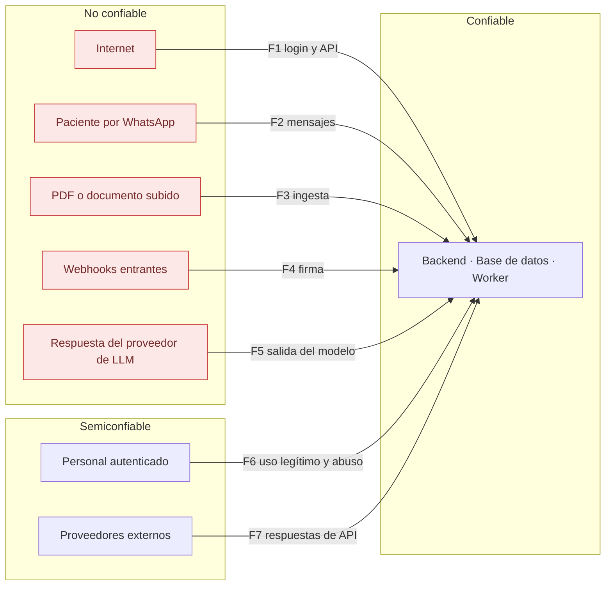

# Modelo de amenazas y matriz de riesgos

> Fase 0. Método: STRIDE sobre los flujos de datos de
> [`architecture.md`](architecture.md), más riesgos específicos de sistemas con agentes
> de IA y riesgos operativos del entorno de desarrollo actual.

---

## 1. Activos a proteger

| # | Activo | Impacto si se compromete |
|---|---|---|
| A1 | Historia clínica, diagnósticos, recetas | Daño grave e irreversible a la privacidad del paciente; responsabilidad legal |
| A2 | Datos identificativos y de contacto | Suplantación, fraude, contacto no deseado |
| A3 | Integridad de la agenda | Pacientes sin atención, doble ocupación, pérdida de ingresos |
| A4 | Credenciales de usuarios del personal | Acceso a A1 y A2 |
| A5 | Tokens OAuth de calendarios de profesionales | Acceso al calendario personal del profesional |
| A6 | Token de WhatsApp Business | Suplantación de la clínica frente a todos los pacientes |
| A7 | Pista de auditoría | Imposibilidad de investigar un incidente |
| A8 | Base de conocimiento aprobada | Información incorrecta dada a pacientes como oficial |
| A9 | Disponibilidad del sistema | Clínica sin poder operar |
| A10 | Respaldos | Fuga masiva si no están cifrados; pérdida total si no restauran |

---

## 2. Superficie de ataque

---

## 3. Análisis STRIDE por flujo

### F1 · Autenticación y API pública

| Amenaza | Vector | Mitigación | Verificación |
|---|---|---|---|
| Spoofing | Fuerza bruta, relleno de credenciales | Argon2id, bloqueo por intentos, límite de tasa por IP y cuenta, 2FA en roles sensibles | Prueba de seguridad de fuerza bruta |
| Spoofing | Robo de token de refresco | Rotación con detección de reutilización que revoca la familia | Prueba de reutilización de refresco |
| Elevation | Manipular el rol en el cliente | Autorización solo en backend; el token no lleva permisos, se resuelven en servidor | Prueba de bypass de rol |
| Elevation | Modificar el `sub` del JWT | Firma verificada; algoritmo fijado; `alg: none` rechazado | Prueba de JWT manipulado |
| Information disclosure | Enumerar pacientes por identificador | UUID; 404 fuera de ámbito; sin mensajes que distingan «no existe» de «no autorizado» | Prueba de IDOR por rol |
| Information disclosure | Enumerar cuentas en recuperación de contraseña | Respuesta idéntica exista o no la cuenta | Prueba de API |
| Repudiation | Negar una acción | Auditoría append‑only con privilegios revocados | Prueba de integridad de auditoría |
| DoS | Saturar el cálculo de disponibilidad | Límite de tasa, rango máximo consultable, caché en Redis | Prueba de carga |

### F2 · Mensajes de WhatsApp

| Amenaza | Vector | Mitigación | Verificación |
|---|---|---|---|
| **Spoofing** | **Un tercero escribe desde el número de un paciente** | El teléfono **no** autoriza acceso clínico; N2/N3 exigen `nivel_verificacion >= DOCUMENTO` | Prueba de bloqueo de información no autorizada |
| Spoofing | Webhook falsificado | Validación HMAC de `X-Hub-Signature-256`; rechazo sin firma válida | Prueba de firma inválida |
| Tampering | Reenvío de webhook | Deduplicación por `wa_message_id` y `payload_hash` | Prueba de webhook duplicado |
| Tampering | Mensajes fuera de orden | Ordenación por marca de tiempo del proveedor; máquina de estados idempotente | Prueba de desorden |
| Information disclosure | Datos clínicos en la pantalla bloqueada | Ningún mensaje incluye diagnóstico ni medicamento; regla no desactivable | Prueba de contenido de plantillas |
| Elevation | Inyección en el texto para invocar herramientas | La autoridad no viene del texto; herramientas con lista blanca | Prueba de inyección por mensaje |
| DoS | Inundación de mensajes | Límite de tasa por conversación; ventana de 24 h respetada | Prueba de cuota |

### F3 · Ingesta de documentos

| Amenaza | Vector | Mitigación | Verificación |
|---|---|---|---|
| **Tampering** | **Inyección de prompt en el PDF** | Documento como dato delimitado; sin herramientas peligrosas; detección en ingesta | Corpus malicioso en el arnés de RAG |
| Tampering | Texto oculto en el PDF | Detección de texto invisible y fuera del área visible; marca para revisión humana | Prueba de ingesta |
| Information disclosure | Documento de una sede recuperado por otra | Pre‑filtro en el `WHERE` de SQL | Prueba de fuga entre sedes |
| Information disclosure | Documento archivado o vencido usado | Filtro de estado y vigencia en SQL | Prueba de documentos caducados |
| Tampering | Archivo malicioso (ejecutable disfrazado, zip bomb) | Tipo real por contenido, límite de tamaño, antivirus | Prueba de subida maliciosa |
| Elevation | Publicar sin aprobación | Máquina de estados; `conocimiento.aprobar` separado de `conocimiento.cargar` | Prueba de API |
| SSRF | Ingesta desde URL apuntando a red interna | Lista blanca; bloqueo de rangos privados y de endpoints de metadatos de nube | Prueba de SSRF |

### F5 · Salida del proveedor de LLM

| Amenaza | Vector | Mitigación | Verificación |
|---|---|---|---|
| **Elevation** | **El modelo pide una herramienta fuera de su alcance** | Autorización con el principal del solicitante; el nombre de herramienta se valida contra lista blanca | Prueba de frontera de IA |
| Tampering | El modelo inventa una cita o un dato | Toda respuesta con datos proviene de herramientas; exigencia de fuente en el modo RAG | Prueba de fundamentación |
| **Daño clínico** | **El modelo sugiere cambiar una dosis** | No existe herramienta de escritura de recetas; lista negra clínica; derivación obligatoria | Prueba de lista negra clínica |
| Information disclosure | El modelo repite datos de otro paciente presentes en su contexto | El contexto se construye solo con datos autorizados del solicitante | Prueba de fuga entre pacientes |

### F6 · Personal autenticado

| Amenaza | Vector | Mitigación | Verificación |
|---|---|---|---|
| Information disclosure | Recepción consulta una historia clínica | Permiso denegado por rol; 404 | Prueba de matriz de permisos |
| Information disclosure | Profesional consulta a un paciente ajeno | Exigencia de relación asistencial; acceso de emergencia declarado y notificado | Prueba de acceso cruzado |
| Tampering | Alterar una nota clínica para ocultar un error | Versiones inmutables con motivo obligatorio; sin privilegio de `DELETE` | Prueba de integridad de historia |
| Repudiation | Negar haber consultado datos | Auditoría de lecturas de datos clínicos | Prueba de auditoría |
| Information disclosure | Exportación masiva no autorizada | `exportacion.solicitar` restringido, con registro y alerta por volumen | Prueba de API |

### F7 · Proveedores externos

| Amenaza | Vector | Mitigación | Verificación |
|---|---|---|---|
| DoS / indisponibilidad | Caída de WhatsApp, calendario o LLM | Outbox con reintentos; degradación funcional; la cita interna nunca se pierde | Pruebas de recuperación |
| Tampering | Cambio externo en el calendario que pisa una cita | La agenda interna es la fuente de verdad; reconciliación que detecta conflicto y alerta | Prueba de cambio externo |
| Information disclosure | Datos clínicos enviados a un tercero | Los eventos y mensajes no llevan contenido clínico | Prueba de contenido saliente |
| Spoofing | Respuesta de API manipulada | TLS con verificación de certificado; sin desactivar la validación en ningún entorno | Revisión de código |

---

## 4. Matriz de riesgos

Probabilidad e impacto en escala 1–5. Prioridad = P × I.

| # | Riesgo | P | I | Pri | Mitigación | Estado |
|---|---|:-:|:-:|:-:|---|---|
| **Seguridad de datos clínicos** | | | | | | |
| S‑01 | Fuga de historia clínica por fallo de autorización | 3 | 5 | **15** | Doble control permiso+ámbito; 404 fuera de ámbito; pruebas de IDOR por rol | Fase 2 |
| S‑02 | Fuga entre pacientes en respuestas de RAG | 3 | 5 | **15** | Pre‑filtro en SQL; sin índice vectorial global de historias | Fase 6 |
| S‑03 | Suplantación de paciente por WhatsApp | 4 | 4 | **16** | El teléfono no autoriza N2/N3; verificación adicional obligatoria | Fase 4 |
| S‑04 | Inyección de prompt logra una acción indebida | 3 | 4 | 12 | Autoridad fuera del prompt; sin herramientas peligrosas | Fase 6 |
| S‑05 | Datos clínicos filtrados en logs | 3 | 4 | 12 | Redacción activa; prueba dedicada de fugas en logs | Fase 2 |
| S‑06 | Robo del token de WhatsApp Business | 2 | 5 | 10 | Solo en gestor de secretos; nunca en el repositorio; rotación documentada | Fase 4 |
| S‑07 | Recepción accede a información clínica | 3 | 3 | 9 | Permiso denegado en backend, no solo en la interfaz | Fase 2 |
| S‑08 | Respaldo sin cifrar expuesto | 2 | 5 | 10 | Cifrado obligatorio; prueba de restauración | Fase 10 |
| **Seguridad clínica** | | | | | | |
| C‑01 | La IA modifica una dosis o un tratamiento | 2 | 5 | 10 | La capacidad no existe; lista negra con prueba bloqueante | Fase 6‑7 |
| C‑02 | Recordatorio de medicación perdido | 3 | 4 | 12 | Outbox transaccional; reintentos; alerta al agotarlos | Fase 7 |
| C‑03 | PRN convertido en horario fijo automático | 3 | 4 | 12 | `CHECK` en base de datos; confirmación profesional obligatoria | Fase 7 |
| C‑04 | Recordatorio de una receta ya modificada | 3 | 4 | 12 | Cancelación de tomas futuras al versionar la receta | Fase 7 |
| C‑05 | El agente da información clínica no aprobada | 3 | 4 | 12 | Exigencia de fuente; «no tengo información aprobada»; derivación | Fase 6 |
| C‑06 | Documento vencido usado como vigente | 3 | 3 | 9 | Filtro de vigencia en SQL; prueba negativa | Fase 6 |
| **Integridad operativa** | | | | | | |
| O‑01 | Doble reserva del mismo turno | 4 | 4 | **16** | Restricción de exclusión en PostgreSQL; pruebas de concurrencia | Fase 3 |
| O‑02 | Dos pacientes aceptan la misma oferta | 3 | 4 | 12 | Bloqueo consultivo + índice único parcial | Fase 5 |
| O‑03 | Webhook duplicado crea una cita doble | 4 | 3 | 12 | Deduplicación e idempotencia | Fase 4 |
| O‑04 | Cita perdida por fallo del calendario externo | 3 | 4 | 12 | Agenda interna como fuente de verdad; outbox | Fase 4 |
| O‑05 | Bloqueo temporal que nunca expira | 3 | 3 | 9 | `expira_en` obligatorio y barrido programado | Fase 3 |
| O‑06 | Desfase de zona horaria en las citas | 3 | 4 | 12 | UTC en almacenamiento; reloj inyectable; pruebas de zona | Fase 3 |
| O‑07 | Cadena de reprogramaciones en bucle | 2 | 3 | 6 | Límite de profundidad de la cadena y detección de ciclos | Fase 5 |
| **Entorno de desarrollo** | | | | | | |
| R‑01 | **Disco C: con 764 MB libres** bloquea Windows o el desarrollo | 4 | 4 | **16** | Todo artefacto en D:; se reporta cualquier necesidad de C: | Fase 0b · **requiere acción del usuario** |
| R‑02 | Memoria insuficiente con MSSQLSERVER activo | 3 | 3 | 9 | Límites en `.wslconfig` y en compose; sugerir detener MSSQLSERVER en pruebas de carga | Fase 0b |
| R‑03 | Integración real de WhatsApp y calendario sin verificar | 5 | 3 | **15** | Sandbox fiel + pruebas de contrato; verificación pendiente en preproducción | **Declarado, no resuelto** |
| R‑04 | Calidad de recuperación insuficiente con embeddings locales | 3 | 3 | 9 | Medición con el arnés; decisión revisable | Fase 6 |
| R‑05 | Aprovisionamiento de WSL requiere elevación | 3 | 2 | 6 | Aviso previo al usuario; script idempotente | Fase 0b |
| **Cumplimiento** | | | | | | |
| L‑01 | Operar sin validación legal | 4 | 5 | **20** | 19 puntos listados en `security.md`; el sistema no se declara apto | **Declarado, requiere al usuario y a un abogado** |
| L‑02 | Transferencia internacional sin base legal | 4 | 4 | **16** | Documentado en el registro de tratamiento | **Pendiente legal** |
| L‑03 | Receta electrónica sin validez formal | 3 | 4 | 12 | Puede exigir firma electrónica; afectaría el diseño | **Pendiente legal** |
| L‑04 | Conflicto entre derecho de eliminación y conservación clínica | 3 | 4 | 12 | Sin borrado automático hasta validación | **Pendiente legal** |

### Riesgos de prioridad 15 o superior

Siete riesgos están en el rango alto. Tres de ellos **no se resuelven con código**:

* **L‑01** (prioridad 20): el sistema no puede operar con pacientes reales sin revisión
  jurídica. Es el riesgo más alto del proyecto y depende del usuario y de un abogado.
* **R‑01** (16): el disco C: del equipo de desarrollo. Requiere que el usuario libere
  espacio.
* **R‑03** (15) y **L‑02** (16): dependen de obtener credenciales y de acuerdos con
  proveedores.

Los otros cuatro —S‑01, S‑02, S‑03, O‑01— sí son responsabilidad técnica y tienen
mitigación diseñada con prueba bloqueante asociada.

---

## 5. Lo que este modelo no cubre

* Seguridad física de las instalaciones de la clínica.
* Estaciones de trabajo del personal: sistema operativo, antivirus y bloqueo de pantalla.
* Seguridad de la red local de la clínica.
* Ingeniería social sobre el personal, más allá de exigir 2FA en roles sensibles.
* Endurecimiento del proveedor de alojamiento de producción, aún sin definir.
* Amenaza interna con acceso administrativo a la base de datos: la auditoría es
  append‑only desde la aplicación, pero un superusuario de PostgreSQL puede alterarla.
  Mitigar esto exige separación de funciones a nivel de infraestructura, fuera del
  alcance de este repositorio.
